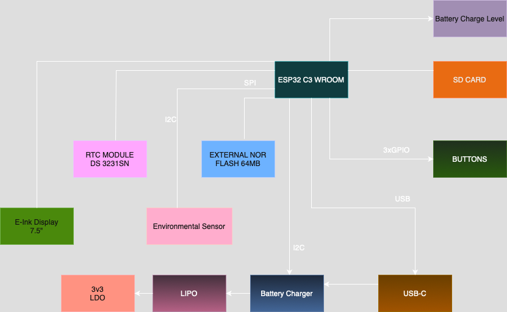

# OpenBook ESP32-C6 Pin Connections

This document describes the pin connections between the ESP32-C6-WROOM-1 module and the various peripherals in the OpenBook e-reader project.

## Project Overview

The OpenBook is an electronic reader device based on the ESP32-C6 microcontroller. It features an e-paper display, SD card storage, environmental sensing, and robust power management for extended battery life. The device was designed to provide a power-efficient reading experience with modern wireless connectivity capabilities.

## Hardware Overview

### Main Controller – ESP32-C6-WROOM-1-N8
- **Architecture**: RISC-V (Single-Core)
- **Wireless**: Wi-Fi 6, Bluetooth 5 LE
- **Operating Voltage**: 3.3V
- **Interfaces**: SPI, I²C, UART, GPIO, USB

## Pin Assignments

| ESP32-C6 Pin | Function | Connected To | Description |
|--------------|----------|--------------|-------------|
| 3 | RESET | Reset Button | System hardware reset |
| 4 | SS_SD | SD Card (pin 2) | SPI Slave Select for SD card |
| 6 | SCK | SD Card (pin 5) | SPI Clock signal |
| 7 | MOSI | SD Card (pin 3) | SPI Master Out Slave In |
| 8 | INT_RTC | RTC Module (pin 3) | Interrupt signal from RTC |
| 9 | 32KHz | RTC Module (pin 1) | 32KHz clock signal from RTC |
| 13 | USB_D- | USB-C Connector (pin 3) | USB Data Negative line |
| 14 | USB_D+ | USB-C Connector (pin 1) | USB Data Positive line |
| 15 | IO/BOOT | Boot Button | Boot mode selector button |
| 16 | RTC_RST | RTC Module (pin 4) | RTC reset control |
| 17 | I2C_PW | BME688 Sensor (pins 6, 8, 2) | Power control for environmental sensor |
| 19 | SDA | Multiple I²C devices | I²C Serial Data line (shared) |
| 20 | SCL | Multiple I²C devices | I²C Serial Clock line (shared) |
| 23 | IO/CHANGE | Change Button | Display/Mode change button |
| 27 | MISO | SD Card (pin 7) | SPI Master In Slave Out |

## Storage & Display

### SD Card
- **Interface**: SPI
- **Pins**:
  - CS (SS_SD): `GPIO 4`
  - MOSI: `GPIO 7`
  - MISO: `GPIO 27`
  - SCK: `GPIO 6`
- **Storage Capacity**: Supports up to 32GB SDHC

### E-Paper Display
- **Interface**: SPI (shared with SD)
- **Pins**:
  - CS (EPD_CS): `GPIO 10`
  - DC (EPD_DC): `GPIO 5`
  - RESET: `GPIO 23`
  - BUSY: `GPIO 3`
  - MOSI / SCK: shared with SD
- **Resolution**: 1404 × 1872 pixels (6.8")

### External NOR Flash (64MB)
- **Interface**: SPI (shared)
- **Pins**:
  - CS (FLASH_CS): `GPIO 12`
  - Shared: `MOSI`, `MISO`, `SCK`

## Timekeeping & Sensors

### RTC – DS3231SN
- **Interface**: I²C
- **Pins**:
  - SCL: `GPIO 20`
  - SDA: `GPIO 19`
  - INT: `GPIO 8`
  - 32KHz: `GPIO 9`
  - RESET: `GPIO 16`

### Environmental Sensor – BME688
- **Interface**: I²C (shared with RTC)
- **Supply Voltage**: 3.3V
- **Power Control Pin**: `GPIO 17`
- **Measurements**: Temperature, humidity, pressure, gas

## Power Management

### Power Supply
- **Input**: USB-C (5V)
- **Output**: 3.3V via LDO regulator
- **Battery**: 3.7V Li-Po, 2000mAh

### Charging Circuit
- **Function**: Li-Po battery charging
- **Charging Current**: 500mA
- **Battery Monitoring**:
  - Fuel gauge via I²C (MAX17048)
  - Pins: Same as shared I²C bus

## Communication & Interfaces

### USB-C Connector
- **Data Pins**:
  - USB_D-: `GPIO 13`
  - USB_D+: `GPIO 14`

### Qwiic / Stemma QT Connector
- **Interface**: I²C
- **Voltage**: 3.3V
- **Pins**: Shared with main I²C bus

## User Inputs
- **BOOT Button**: `GPIO 15`
- **RESET Button**: connected to pin 3
- **CHANGE Button**: `GPIO 23`

## Protection Features
- TVS diodes on USB data lines and SPI lines
- Reverse polarity protection
- ESD protection

## Components BOM (Bill of Materials)

| Component | Link | Estimated Price |
|------------|------|----------------|
| CHG_LED | [KP-1608SURCK - Kingbright](https://www.snapeda.com/parts/KP-1608SURCK/Kingbright/view-part/?ref=search&t=LED%200603) | €0.15 |
| SJ1 | [Solder Jumpers](https://grabcad.com/library/solder-jumpers-1) | €0.05 |
| R3 | [R0402 1% 100K (RC0402FR-07100KL) - YAGEO](https://componentsearchengine.com/part-view/R0402%201%25%20100%20K%20(RC0402FR-07100KL)/YAGEO) | €0.01 |
| R1_PWRUSB | [R0402 1% 100K (RC0402FR-07100KL) - YAGEO](https://componentsearchengine.com/part-view/R0402%201%25%20100%20K%20(RC0402FR-07100KL)/YAGEO) | €0.01 |
| C1, C2, C4_USB, C6, C7, C8, C9, C10, C_DELAY | [CC0402MRX5R5BB106 - YAGEO](https://componentsearchengine.com/part-view/CC0402MRX5R5BB106/YAGEO) | €0.10 (per unit) |
| C3 | [Link 3D model](https://a360.co/4iZy6AA) | €0.12 |
| R1_PINH1, R2-PINH1, R_BOOT, R_CHARGE, R_CL1, R_RESET | [R0402 1% 100K (RC0402FR-07100KL) - YAGEO](https://componentsearchengine.com/part-view/R0402%201%25%20100%20K%20(RC0402FR-07100KL)/YAGEO) | €0.01 (per unit) |
| R1, R1-PINH, R2-PINH, R4, R5, R6, R7, R8, R9, R10 | [R0402 1% 100K (RC0402FR-07100KL) - YAGEO](https://componentsearchengine.com/part-view/R0402%201%25%20100%20K%20(RC0402FR-07100KL)/YAGEO) | €0.01 (per unit) |
| J4 | [Store Comet SRL](https://store.comet.srl.ro/Catalogue/Product/43497/) | €0.35 |
| R_CAPACITOR | [R0402 1% 100K (RC0402FR-07100KL) - YAGEO](https://componentsearchengine.com/part-view/R0402%201%25%20100%20K%20(RC0402FR-07100KL)/YAGEO) | €0.01 |
| C5 | [CC0402MRX5R5BB106 - YAGEO](https://componentsearchengine.com/part-view/CC0402MRX5R5BB106/YAGEO) | €0.10 |
| EPD_C1, EPD_C2, EPD_C5, EPD_C6, EPD_C7, EPD_C8, EPD_C9, EPD_C10, EPD_C11, EPD_C12 | [CC0402MRX5R5BB106 - YAGEO](https://componentsearchengine.com/part-view/CC0402MRX5R5BB106/YAGEO) | €0.10 (per unit) |
| R2 | [R0402 1% 100K (RC0402FR-07100KL) - YAGEO](https://componentsearchengine.com/part-view/R0402%201%25%20100%20K%20(RC0402FR-07100KL)/YAGEO) | €0.01 |
| R1_BAT | [R0402 1% 100K (RC0402FR-07100KL) - YAGEO](https://componentsearchengine.com/part-view/R0402%201%25%20100%20K%20(RC0402FR-07100KL)/YAGEO) | €0.01 |
| Q1, Q3 | [SI1308EDL-T1-GE3 - Vishay](https://componentsearchengine.com/part-view/SI1308EDL-T1-GE3/Vishay) | €0.45 (per unit) |
| R2_BAT | [R0402 1% 100K (RC0402FR-07100KL) - YAGEO](https://componentsearchengine.com/part-view/R0402%201%25%20100%20K%20(RC0402FR-07100KL)/YAGEO) | €0.01 |
| C1_BAT, C1_BAT1, C1_BAT2, C2_BAT, C5_USB | [CC0402MRX5R5BB106 - YAGEO](https://componentsearchengine.com/part-view/CC0402MRX5R5BB106/YAGEO) | €0.10 (per unit) |
| C4 | [CC0402MRX5R5BB106 - YAGEO](https://componentsearchengine.com/part-view/CC0402MRX5R5BB106/YAGEO) | €0.10 |
| R2-USB, R2-USB1 | [R0402 1% 100K (RC0402FR-07100KL) - YAGEO](https://componentsearchengine.com/part-view/R0402%201%25%20100%20K%20(RC0402FR-07100KL)/YAGEO) | €0.01 (per unit) |
| L1 | [744043680 - Wurth Elektronik](https://eu.mouser.com/ProductDetail/Wurth-Elektronik/744043680?qs=PGXP4M47uW6VkZq%252BkzjrHA%3D%3D) | €0.85 |
| IC1 | [BD5229G-TR - ROHM Semiconductor](https://componentsearchengine.com/part-view/BD5229G-TR/ROHM%20Semiconductor) | €1.20 |
| BOOT_BUTTON, CHANGE_BUTTON, RESET_BUTTON | [EVQP7L01P - Panasonic](https://www.snapeda.com/parts/EVQP7L01P/Panasonic/view-part/?ref=search&t=evqp7l) | €0.25 (per unit) |
| C10_SUPERCAP | [CPH3225A - Seiko Instruments](https://www.snapeda.com/api/url_track_click_mouser/?unipart_id=562593&manufacturer=Seiko%20Instruments&part_name=CPH3225A&search_term=None) | €2.50 |
| U3 | [DS3231SN - Analog Devices](https://www.snapeda.com/api/url_track_click_mouser/?unipart_id=99048&manufacturer=Analog%20Devices&part_name=DS3231SN#&search_term=None) | €8.95 |
| U2 | [ESP32-C6-WROOM-1-N8 - Espressif](https://www.snapeda.com/parts/ESP32-C6-WROOM-1-N8/Espressif+Systems/view-part/?ref=eda) | €4.50 |
| PFMF.050.1 | [B72520T0350K062 - EPCOS-TDK](https://www.mouser.co.uk/ProductDetail/EPCOS-TDK/B72520T0350K062?qs=dEfas%2FXlABIszF52uu7vrg%3D%3D) | €0.65 |
| D2, D7 | [SD0805S020S1R0 - KYOCERA-AVX](https://eu.mouser.com/ProductDetail/KYOCERA-AVX/SD0805S020S1R0?qs=jCA%252BPfw4LHbpkAoSnwrdjw%3D%3D) | €0.30 (per unit) |
| SENSOR2 | [BME680 - Bosch](https://www.snapeda.com/parts/BME680/Bosch/view-part/?welcome=home) | €10.50 |
| MCP73831 | [MCP73831T-2ACI-OT - Microchip](https://www.digikey.ro/en/products/detail/microchip-technology/MCP73831T-2ACI-OT/964301) | €0.75 |
| J1 | [XC6220A331MR-G - Torex](https://componentsearchengine.com/part-view/XC6220A331MR-G/Torex) | €1.25 |
| U4 | [MAX17048G+T10 - Analog Devices](https://www.snapeda.com/api/url_track_click_mouser/?unipart_id=329239&manufacturer=Analog%20Devices&part_name=MAX17048G+T10&search_term=None) | €3.80 |
| D3, D4, D5 | [MBR0530 - ON Semiconductor](https://www.snapeda.com/api/url_track_click_mouser/?unipart_id=179458&manufacturer=ON%20Semiconductor&part_name=MBR0530&search_term=None) | €0.40 (per unit) |
| D6, D8, D9, D10, D11, D12 | [PGB1010603MR - Littelfuse](https://www.snapeda.com/api/url_track_click_mouser/?unipart_id=5659453&manufacturer=Littelfuse%20Inc.&part_name=PGB1010603MR&search_term=None) | €0.30 (per unit) |
| J3 | [Model Link - DigiKey](https://www.digikey.ro/en/models/926710) | €1.05 |
| J2 | [USB4110-GF-A - GCT](https://componentsearchengine.com/part-view/USB4110-GF-A/GCT%20(GLOBAL%20CONNECTOR%20TECHNOLOGY)) | €0.95 |
| Q2 | [DMG2305UX-7 - Diodes Inc](https://componentsearchengine.com/part-view/DMG2305UX-7/Diodes%20Incorporated) | €0.55 |
| TP1, TP2, TP3, TP4, TP5, TP6, TP7, TP8, TP9, TP10, TP11, TP12, TP13, TP14, TP15, TP16, TP17 | [Test Points PCB](https://grabcad.com/library/test-points-printed-circuit-board-1) | €0.02 (per unit) |
| D1 | [USBLC6-2SC6Y - STMicroelectronics](https://www.snapeda.com/parts/USBLC6-2SC6Y/STMicroelectronics/view-part/?ref=eda) | €0.60 |
| U1 | [W25Q512JVEIQ - Winbond](https://www.snapeda.com/parts/W25Q512JVEIQ/Winbond+Electronics/view-part/?ref=eda) | €4.20 |
| IC4 | [XC6220A331MR-G - Torex](https://componentsearchengine.com/part-view/XC6220A331MR-G/Torex) | €1.25 |

## Circuit Block Diagram
